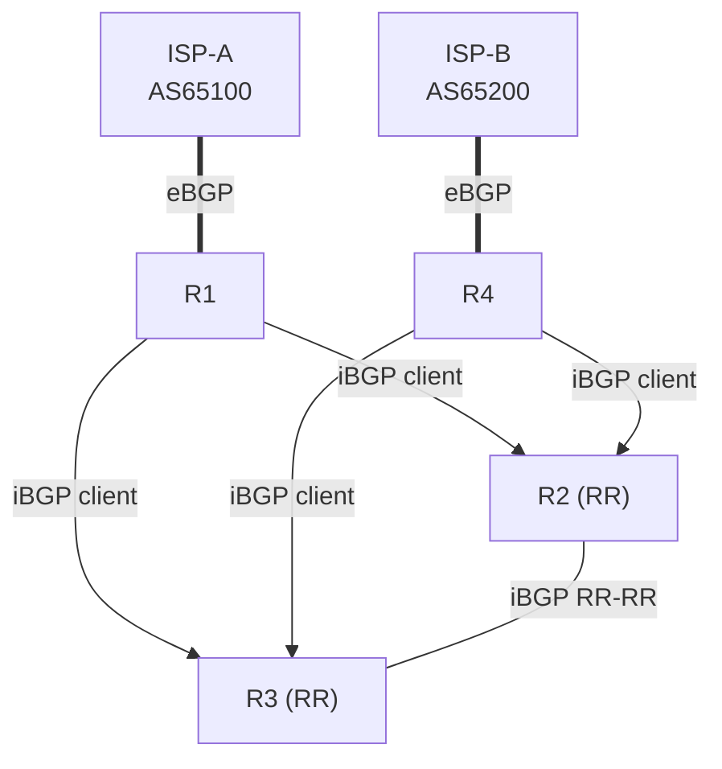

# Topology — physical wiring vs BGP sessions

The thing that confuses people about BGP is that the **session mesh is not the wiring**. Two views:

## 1. Physical / IGP wiring (where the cables are)

```
        ISP-A (AS65100)                         ISP-B (AS65200)
         100.100.100.100                          200.200.200.200
              |  100.64.1.0/30                          |  100.64.2.0/30
              |                                          |
          +---+---+        10.12 /30          +-----+   |
          |  R1   |---------------------------|  R2 |   |
          |1.1.1.1|        10.13 /30          |2.2.2|---+ 10.24 /30
          +---+---+\                      ____/+--+--+
              |     \____________________/        | 10.23 /30 (cross-link)
              |  10.13/30      10.34/30   \     +--+--+
              |                            \____| R3  |
          +---+---+        10.34 /30            |3.3.3|
          |  R4   |----------------------------+--+--+
          |4.4.4.4|        10.24 /30              |
          +---+---+------------------------------+
              |
         (to ISP-B above)
```

Core links (10.x /30) run IS-IS. The two ISP links (100.64.x /30) run **only** eBGP — they are
deliberately *not* in the IGP.

> ASCII gets cramped — the link table in the [README](../README.md#addressing-plan) is the source
> of truth for exact interfaces and addresses.

## 2. BGP session overlay (who peers whom)

```
   eBGP                                                   eBGP
 ISP-A === R1                                     R4 === ISP-B
            \\                                   //
             \\  iBGP (to BOTH route reflectors)//
              \\                                //
               R2 ============================ R3
                       iBGP (RR <-> RR, non-client)

  Legend:
   ===  eBGP session (different AS)
   \\   iBGP session, client -> route reflector
   R2,R3 = route reflectors (clients: R1, R4)
```

Key point: after Phase 3, **R1 and R4 do not peer each other** in BGP — they each peer only the two
RRs (R2, R3). The RRs reflect routes between them. Physically R1 and R4 are still reachable to each
other through the core; that's the IGP's job, not BGP's.

## Why two route reflectors

Each client (R1, R4) holds an iBGP session to **both** RRs. Lose one RR (or the path to it) and the
client still has the other — no client is ever isolated. Each RR uses its own cluster-id so both
reflected copies of a route remain usable (path diversity preserved).

## Mermaid version (renders on GitHub)


